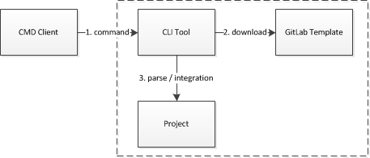

命令行工具开发方案
================

## 背景

每次启动新项目，都需要从旧项目中拷贝脚手架到新项目

项目组之间使用各自的开发规范和脚手架，不仅规范不统一，而且重复造轮子无法沉淀。

不同的项目需要的脚手架也不同，比如：组件库、Web项目、App项目、多包管理的项目等。

## 目标

通过命令行工具，统一公司的编码规范、Git规范、样式规范、单元测试、覆盖率、脚手架、路由、国际化、数据模型、目录结构、文档生成、PWA等基础支撑，使公司内所有前端项目都能通过该工具快速启动。

## 实现方案
整体流程：

通过命令行客户端输入命令，由命令行工具接收命令，从GitLab仓库拉取选择的模板，由命令行工具对模板进行解析并整合用户自定义的服务，最终生成项目基础框架。

命令行工具使用lerna进行包管理，目前包含lds-cli和lds-scripts两个npm包。

1. lds-cli：用于接收/调度命令
   
   通过commander/inquirer工具接收命令，然后调用lds-scripts。
   
2. lds-scripts: 提供模板下载、模板解析、集成可定制的基础特性和中台服务。
   
   通过download-git-repo工具从gitlab下载模板，由handlebars解析，然后根据用户选择的基础特性和中台服务与模板进行合并，生成最终的项目起手式。
   
   基础特性包含：编码规范、Git规范（含jira集成）、样式规范、文档生成、单元测试、覆盖率、PWA、TS/ES6等，并且可以与模板建立关联，比如：Web项目模板必须包含编码规范、Git规范。

   中台服务：所有发布到npm私服的中台服务，并且可以与模板建立关联，如：基础UI组件、通讯服务、JSBridge、领域服务等。

模板: 提供web项目、app项目、组件库和lerna包管理，也可以自行扩展模板仓库。

所有的模板都可以包含lds-scripts的公共基础特性。

模板默认包含示例代码，可以通过`npm run clear`命令移除示例代码。

1. web项目
   
   公司内所有的Web项目都可以使用该模板。该模板在create-react-app的基础上，添加路由（含代码拆分）、国际化（接入国际化平台）、redux数据模型等基础服务。

2. app项目
   
   公司内所有的app项目都可以使用该模板。该模板在create-react-app的基础上，添加路由（含代码拆分）、国际化（接入国际化平台）、redux数据模型、WPA等基础服务。

3. 组件库
  
   公司内所有的组件库都可以使用该模板。该模板通过rollup进行打包。

4. lerna包管理
   
   基于lerna，在一个仓库里管理多个npm包。

## 在IDE平台发挥的作用
命令行工具作为IDE平台代码生成的起手式，所有通过IDE生成的小前台，都会先通过命令行工具生成基础工程，然后再此基础上添加生成的代码并构建。

## 如何使用
### 启动新项目
1. 从公司私服下载命令行工具，如：`yarn global add @company/cli`
2. 执行命令：`cli create projectName`
3. 选择模板：web project/app project/components/lerna
4. 选择服务：ES6/Type Script、基础UI服务、鉴权服务、通讯服务、设备服务等中台提供的各类服务
5. 下载并安装完成后，进入projectName目录，执行：`yarn start`启动项目

## 后续
后续可以建立可视化界面生成项目基础框架。
