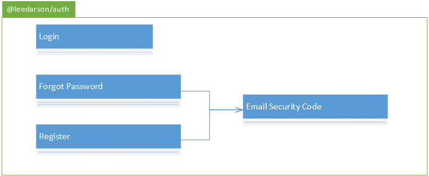
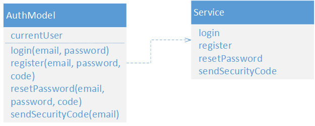

# 运维App开发方案
## 技术选型
采用原生+React开发，原生使用多WebView方案，H5通过JSBridge与原生通讯。React采用create react app搭建脚手架，使用ES6 + redux + redux-saga + react-router + axios + immutable + ant mobile技术栈。

H5站点部署到AWS服务器，App通过远程访问H5代码。

## 项目结构
```
./
├── mock/                      // 存放 mock 数据
├── src/                       // 项目源代码
├── ├── assets                 // 存放模块内使用的静态资源，如：图片、全局样式等
├── ├── i18n                   // 国际化
├── ├── components             // 组件，分为布局组件、业务组件和基础组件
├── ├── models                 // 数据模型，用于业务逻辑处理与接口交互
├── ├── routes                 // 路由组件
├── ├── utils                  // 工具箱
├── ├── index.js               // 整站主入口
├── public/                    // 存放全局的静态资源
├── test/                      // 测试代码存放处，按业务功能或页面划分
└── package.json               // webpack 配置文件
```

## 项目依赖
### 私有仓库
    @leedarson/app/auth: 鉴权
### 公有仓库
    redux
    redux-saga
    react-router
    axios
    immutable
    ant mobile

## 新建私有仓库
### @leedarson/app/auth: 鉴权
从work with迁移登录、找回密码、邮件验证码、注册组件，仓库名称为@leedarson/auth

### 依赖
    ant mobile
#### 组件关系


#### 登录组件

组件名称：Login

组件描述：

    通过邮箱和密码登录系统，提供忘记密码和注册账号的入口，登录成功后，自动把token记录到cookie。

组件规则：

    邮箱和密码都是必填
    邮箱必须合法
    密码规则:
        1. 至少6个字符
        2. 至少一个大写字符
        3. 至少一个小写字符
        4. 至少一个数字


组件属性：

属性名 | 属性描述 | 类型 | 默认值
------ | ------ | ------ | ------
title | 标题名称 | string | -
className | 容器的类名 | string | -
forgotPasswordUrl | 忘记密码的路由地址 | string | -
createAccountUrl | 创建账户的路由地址 | string | -
onLogin | 登录成功后回调函数 | 	function | -

#### 注册组件
组件名称：Register

组件描述：

    通过邮箱注册。使用邮件验证码验证邮箱有效性。
    注册成功后自动返回登录页

组件规则：

    邮箱和密码都是必填
    邮箱必须合法
    密码规则:
        1. 至少6个字符
        2. 至少一个大写字符
        3. 至少一个小写字符
        4. 至少一个数字


组件属性：

属性名 | 属性描述 | 类型 | 默认值
------ | ------ | ------ | ------
className | 容器的类名 | string | -
onRegistered | 登录成功后回调函数 | 	function | -

#### 找回密码组件

组件名称：ForgotPassword

组件描述：

    通过邮箱找回密码。用户输入邮箱，发送邮件验证码，通过验证码确保账户的合法性，然后通过新密码完成密码找回。
    密码重置成功后，自动返回登录页，重新登录

组件规则：

    邮箱、验证码、新密码、确认新密码都是必填
    邮箱必须合法
    密码规则:
        1. 至少6个字符
        2. 至少一个大写字符
        3. 至少一个小写字符
        4. 至少一个数字


组件属性：

属性名 | 属性描述 | 类型 | 默认值
------ | ------ | ------ | ------
className | 容器的类名 | string | -


#### 邮件验证码组件
组件名称：EmailSecurityCode

组件描述：

    通过邮件模板，给邮箱发送验证码

组件属性：

属性名 | 属性描述 | 类型 | 默认值
------ | ------ | ------ | ------
name | 发送验证码的按钮名称 | string | -
email | 发送的验证码的邮箱地址 | string | -
className | 容器的类名 | string | -
onSended | 邮件验证码发送成功回调 | function | -


#### 数据模型


## 组件规划
Layout

Modal

QrCode

package/Gateway

package/Rule

package/Mac

package/Ap

package/Checklist

direct/Unbound

direct/Mac

## 数据模型

PackageModal

Direct

## 路由规划
路径 | 描述
------ | ------
/ | 主页
/login | 登录
/forgotPassword | 忘记密码
/qrcode | 二维码扫描
/package/gateway | 套包删除网关
/package/rule | 通过_modeid从云端获取套包规则
/package/mac | 通过mac恢复被激活的报表数据
/package/ap | 连接网关ap
/package/checklist | 套包checklist
/direct/unbound | 直连设备解绑
/direct/mac | 通过mac恢复被激活的报表数据

## 国际化

## 原生
提供二维码扫描
多WebView支持