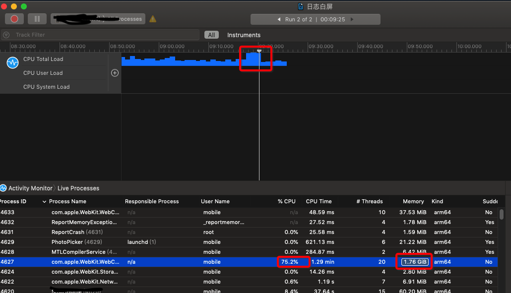
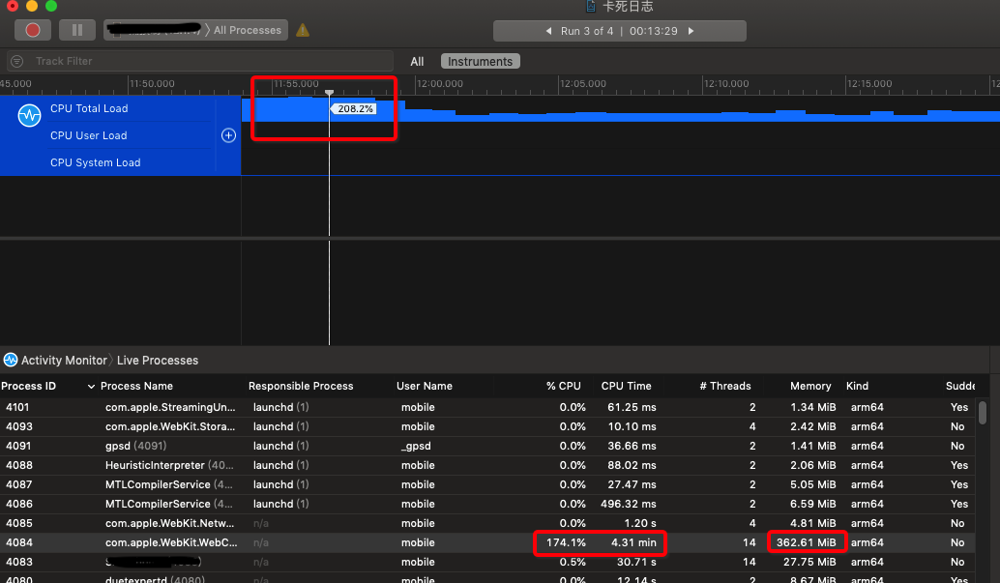
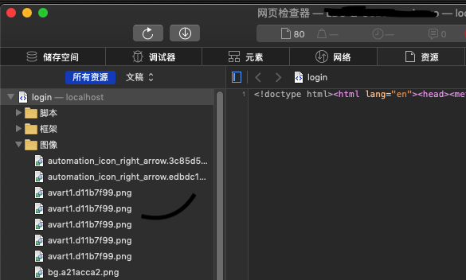
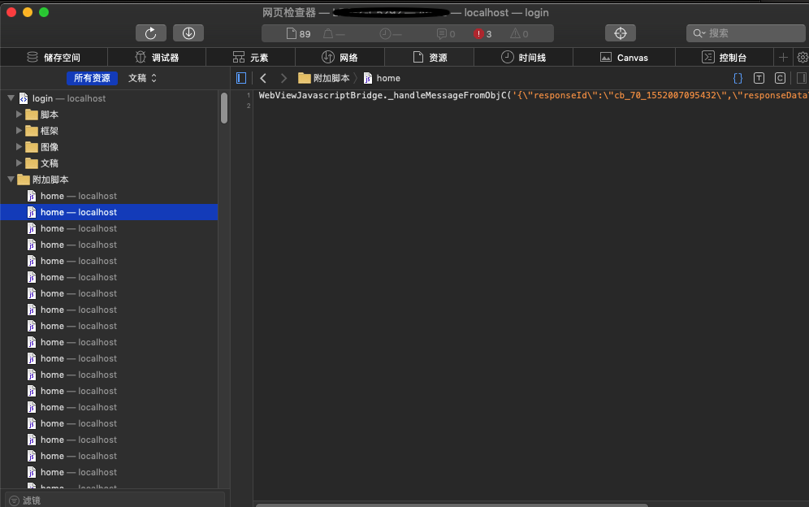
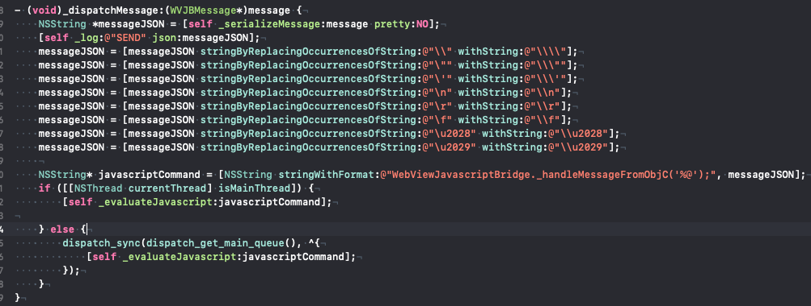
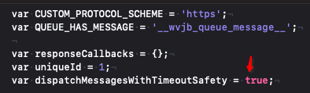
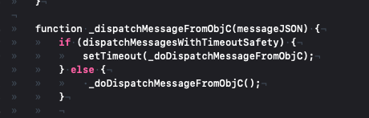

# App性能优化总结
## 一、问题描述
页面白屏问题：使用app时，偶发app变成白屏，需要杀掉APP

页面定屏问题：使用app时，页面卡死，需要杀掉APP重新启动，或等待几秒或更长时间，才能响应

页面卡顿问题：使用app点击操作时，等待较长时间才会进行页面过渡，或页面过渡不够流畅

## 二、问题定位
1. 通过系统工具Isntruments的Activity Monitor，定位出白屏问题因webview的渲染进程消耗内存过大，出于系统保护机制进程被强制杀掉，导致白屏。下面是问题的最新截图


1. 页面卡住的问题，也是通过系统工具Isntruments的Activity Monitor 发现webview的渲染进程CPU过高导致的。


1. 页面卡顿问题：由于计算操作过多，整体执行时间过长，android上有很明显卡顿


## 三、分析过程
### 第一阶段
通过Safari的开发工具，监控手机的Web服务发现：发现重新渲染页面时，会重新请求图片，而不是从缓存直接获取。即图片资源重复加载的问题。经代码分析，由require(‘xxx’)动态引入的文件在iOS上都有该问题，因此对系统的require()引入改成了import头部引入，解决了iOS重新请求的问题。但系统内大部份的require()引入是动态拼装成的路径，import头部引入无法满足该情况，所以该内存减少的优化量较少，事后也证明该问题不是主要原因。



### 第二阶段
经safari开发者工具分析后，jsBridge在每次切换tab标签时会同时发起10~20多个jsBridge请求，而且是每次切换的时候都会发起，当快速点击tab时会发起大量的JSBridge请求和重新渲染，导致CPU和内存双升。所以我们对Tabs标签页的组件进行缓存，当切换tabs时，从缓存渲染组件，这样只有在首次渲染时会挂载，再次渲染时，只会触发更新组件的生命周期。
- 页面切换时大量的JSB消息
  


通过查看JSB的源码发现，如果原生是在子线程调JS方法是在主线程同步调用



而JSB内部代码又是异步的setTimeout




[查看setTimeout原理发现](https://www.cnblogs.com/Jersen/p/4887225.html)：setTimeout调用的时候，JavaScript引擎会启动定时器timer，大约millisec(ms)以后执行code，当定时器时间到，就把该事件放到主事件队列等待处理。

注意：

浏览器JavaScript线程空闲的时候才会真正执行

为什么呢？因为当JavaScript线程的正在出来其他JavaScript代码时，其实以已经阻塞了其他的代码，其中包括的setTimeout的定时器部分的实现。

所以，在频繁切换界面和大量JSB消息的时候，JS线程一直在处理其他任务，setTimeout部分的逻辑一直在等待。

WebViewJavascriptBridge 作者描述

Hi everyone! Wanted to give a quick update and add some notes:

When ObjC calls javascript in a UIWebView, and the javascript uses any synchronous API which causes an OS-level UI to appear (e.g alert & confirm)
 then the main app's main thread will freeze. (This actually makes complete sense :) Objc calls into JS on the main thread, which is also the UI thread;
 the JS, running on the main thread, then creates an OS-native modal box with e.g alert(), and then blocks. The problem is that since that at this point 
the main thread is blocking/froze - since the JS is running on the main thread - but all UI events are also handled by the main thread in iOS! And so, 
the main thread deadlocks). I've made a bunch of improvements in master, but some of them are not backwards compatible. Thus, I plan to take advantage 
of the next release and improve the API a bit. One of the intended changes is to remove the default handler, and only use named handlers. The only change
 will be to include "options" during setup, e.g to disable alert safety, perhaps add timeouts to requests (#106), etc.

So... My plan is to delay this PR just a bit longer, but then merge it in after the next release. I hope this sounds good to everyone! If not, let me know :)

## 四、可处置方案
### 1. 在H5的JS Bridge里通过disableJavscriptAlertBoxSafetyTimeout()关闭setTimeout调用
查看JSB源码发现,已提供相应的接口提供调用。只要在H5的JSB对象初始化之后调用下面的接口。
```js
function disableJavscriptAlertBoxSafetyTimeout() {
    dispatchMessagesWithTimeoutSafety = false;
}
```
或
```js
registerHandler("_disableJavascriptAlertBoxSafetyTimeout", disableJavscriptAlertBoxSafetyTimeout);
```
原生也提供了相应的接口（不过最好在H5中修改，原生调用时可能JSB对象没有初始化，导致设置无效）
```objc
- (void)disableJavscriptAlertBoxSafetyTimeout;
```
禁用setTimeout后频繁的操作的内存和CPU变化


### 2. 首页的tabs使用原生实现，一级页面跳转使用原生导航多WebView方案
该方案涉及原生、H5、打包方案的改造，影响较大且成本也高。

### 3. 首页tabs的切换不再每次都重新挂载组件，首次挂载后把组件缓存起来，再次切换到该Tab时直接从缓存展示组件。
在不影响当前框架与业务逻辑的前提下。对一级页面做缓存处理，在切换页面过程的时候不对组件做卸载与重新挂载的操作，改为显示隐藏组件的方式进行。在组件切换过程中会触发隐藏组件的componentWillReceiveProps和shouldComponentUpdate方法。最后针对所有一级页面组件中的这两个生命周期方法做修改，只有组件处于显示状态下才运行该这两个方法中的程序。

可能产生的问题：由于组件再次展示时不再重新挂载，是否会影响到组件的功能。

## 五、最终处置方案
经权衡成本、时间、人力因素，我们采用了1+3两种组合方案。

优化完成后，内存、CPU都降到合理的范围内，连续使用30分钟，没有出现内存、CPU异常。

## 六、总结
首先利用工具从内存、CPU、请求数和日志进行问题定位，找出主要的性能开销及异常情况，再针对大量的开销制定解决方案。

## 七、后续优化方向
通过按需获取，减少首次渲染无用的JSB消息 

通过合并请求，减少同一时间并发太多请求 

通过React组件级代码优化，减少无用的dom渲染

对于请求时间过长的接口，分析定位具体的开销，减少接口请求的时间
