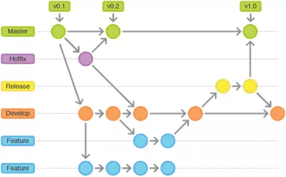
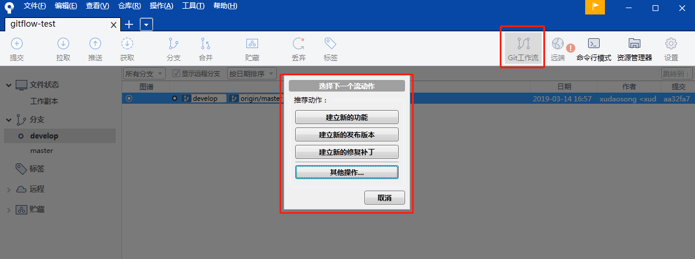

# 源码管理
源码管理采用Git flow分支管理规范和流程。

Git flow重点解决的是由于源代码在开发过程中的各种冲突导致开发活动混乱的问题，提高开发效率。

## Git flow的完整流程

**注意：不允许在master和develop分支直接提交代码，只能合并代码**

1. 每一个大版本我们会创建一个单独的feature分支，项目开发人员基于这个单独的feature分支创建自己的任务分支。比如，对于启动的时候分支的创建是：master -> develop -> feature/v2。开发人员应该基于这个大特性分支feature/v2来创建自己的任务分支，比如开始SOFT-1530的jira任务开发，可以用一个单独的分支feature/v2/SOFT-1530。该任务开发、自测并通过QA功能测试后，立即向上游分支（feature/v2）提交merge request。然后从feature/v2 创建自己的下一个任务分支，比如SOFT-1531的Jira任务feature/v2/SOFT-1531。
2. 在各个分支遇到的bug，请基于该分支创建一个Bug分支。命名采用缺陷跟踪管理系统（如：jira）的Bug ID，例如：bugfix/SOFT-970。完成修改以后提交并推送到中心仓库然后立即向上游分支提交merge request。
3. 遇到线上紧急bug，从master建立hotfix，如:hotfix/v2.0.1，然后从hotfix建立bug分支，如：bugfix/SOFT-970，bug修复完成后，通过merge request向hotfix合并，然后通过hotfix提测并发布，发布成功后进行hotfix finish。
4. 发起merge request以后，请将merge request的链接在IM上发给代码审核者，以此通知对方及时进行审核。

## 冲突处理
如果发生冲突，原则上从target分支合并到source分支，处理完冲突后再合并到target分支。如：从feature分支合并到develop分支发生冲突，一般将develop分支合并到feature，在feature分支上处理冲突后再合并到develop。

### 遇到的问题

1. release到dev冲突

     背景：release已经发布成功，但还需要继续在release上修改代码并再次发布，按正常流程release发布后，就删除了，而且当时不知道厦门还需要在release上继续修改代码并发布

     处置过程：在release分支合并到dev分支发生冲突，按流程需要先把dev分支合并到release分支，在release分支处理完冲突后再合并到dev分支，然后由dev分支新建release分支，但由于业务需要，旧的release分支后续还需要继续开发和发布（按正常git flow流程，不能同时存在两个release分支的），因此，旧的release分支上包含了下个版本的功能代码，导致无法在使用旧的release分支继续开发和发布。

     解决办法：
     1. 如果release合并到dev发生冲突，则在release分支上新建专门用于合并的release分支，如：release_merge，然后把dev分支合并到release_merge并解决完冲突后，再合并到dev，同时删除release_merge分支
     2. 所有需要从旧的release上继续开发的功能或bug，改成从master分支建立hotfix，走hotfix流程

## Git flow分支介绍

Git flow包含master、develop、feature、release和hotfix分支。长期存在的只有develop和master分支，其它的都是临时分支，合并后会被移除。

### master分支

master用于存放所有正式发布的版本，与生产环境代码保持一致，不允许直接提交代码，只能通过release和hotfix分支合并更新代码。

**注意：不允许在master分支直接提交代码，只能合并代码**

### develop分支

develop为主开发分支，不能直接提交代码，但可以通过hotfixes、feature、release分支合并更新代码。

**注意：不允许在develop分支直接提交代码，只能合并代码**

### feature分支

feature为新功能开发分支，可以同时存在多个feature分支。feature分支都是基于develop创建的，开发完成后只能合并到develop分支。

### release分支

release分支是从develop分支创建，用于在交付测试后，修改bug和发布新版本。

release分支同一时间只能有1个，生命周期很短，只是为了修改bug和发布。

**注意：**
**1.不允许在release分支上开发新功能，只能修复bug。**
**2.不要从develop分支上合并新的改动到release分支。**

### hotfix分支

hotfix分支只能从master分支创建，为了对线上版本的Bug进行修复，完成后直接合并到master分支和develop分支。

release分支同一时间只能有1个，生命周期很短，只为了修复线上紧急bug。

如果当前还有新功能release分支，需要先手动同步到release分支。

## 场景

### 正常的业务迭代

1. 新的需求审评完成并准备进行开发前，从develop分支创建feature分支
2. 在feature分支上完成功能开发和自测
3. 自测完成后合并到develop，并从develop创建release分支用于交付测试，QA提交的BUG都在该分支上修改
4. 交付测试通过后，直接使用该release分支发布上线
5. 上线成功后，把release分支合并到master和develop，并在master上添加tags

### 线上紧急问题修复

1. 线上发现紧急问题需要立即修复，从master创建hotfix分支
2. 在hotfix分支上完成bug修复、自测、交付测试和发布
3. 交付测试通过后，把hotfix分支合并到master和develop分支
4. 如果当前存在release版本，也需要合并到release

## Vistual Studio Code 使用 Git flow

1. 在vs code的扩展程序里安装gitflow插件
   
   

2. 使用`ctrl + shift + P`打开命名面板，输入`gitflow`发现如下命令：

   

   - Gitflow: Initialize repository for gitflow

        用于把当前仓库初始化为gitflow管理方式，使用默认配置即可。

   - Gitflow: Feature:start

        用于开始新功能新特性开发，该命令会基于develop创建新的分支

   - Gitflow: Feature:end
  
        新功能开发并自测完成后，执行该命令。该命令会把当前的特性分支合并到develop并把该特性分支关闭。

   - Gitflow: Release:start
        
        该命令会基于develop创建release分支，在此分支上提测、Bug修复和发布。，release的命名建议为`v**.**.**`命名，如`v1.0.0`

   - Gitflow: Release:end

        经过QA测试通过并成功发布后，执行该命令。该命令会把代码同时合并到master和develop，并在master上建立tag，tag的命名建议为`v**.**.**`命名，如`v1.0.0`

   - Gitflow: hotfix:start

        用于修复线上紧急问题，该命令会基于master创建新分支，在此分支上修改线上bug、提测和发布。

   - Gitflow: hotfix:end
        
        线上紧急问题发布成功后，执行该命令。该命令会把代码合并到master和develop。

        **注意：如果当前有release分支，需要手动合并到release**

## 使用SourceTree工具

1. 到官网下载并安装SourceTree，下载地址：[https://www.sourcetreeapp.com/](https://www.sourcetreeapp.com/)
2. 从gitlab上clone分支，如下图
   
3. 在工具栏中点击gitflow，初始化git仓库为gitflow模式，采用默认配置即可，如下图
   
4. 初始化完成后，再次点击工具栏中的Gitflow，就可以创建新的功能、建立新的发布版本或者建立新的修复补丁，其他操作里有完成功能、完成发布版本、完成修复补丁。
   
   - 创建新的功能

        与Gitflow: Feature:start 命令的操作相同

   - 建立新的发布版本

        与Gitflow: Release:start 命令的操作相同

   - 建立新的修复补丁

        与Gitflow: hotfix:start 命令的操作相同
        
   - 完成功能

        与Gitflow: Feature:end 命令的操作相同
        
   - 完成发布版本

        与Gitflow: Release:end 命令的操作相同，不同的是，默认的tags名称为release分支的名称
        
   - 完成修复补丁

        与Gitflow: hotfix:end 命令的操作相同
        
   
## 代码仓库的迁移方案

### 第一阶段：迁移线上代码

1. 在Gitlab建立新的Git flow仓库
2. 建立新功能分支，把目前线上的版本拷贝一份到新功能分支
3. 完成新功能分支，并创建release分支，同时完成release分支，给master打tag

### 第二阶段：迁移目前开发中的分支

1. 梳理现有的开发需求，哪些是要在近期上线的功能，哪些是要在远期上线的需求，按上线版本归类
2. 通过不同的上线版本建立各自的功能分支，然后把各自功能分支的业务代码手工同步覆盖。例如：把v1.0.0要上线的代码手工同步到v1.0.0功能分支；把v1.1.0要上线的代码手工同步到v1.1.0功能分支
3. 代码同步前所有的代码都要签入。代码同步需要相关开发人员或开发负责人执行，拷贝代码文件到各自功能分支进行覆盖
4. 完成代码同步并提交到gitlab后，所有开发人员在新仓库的功能分支上进行开发任务
5. 完成git代码迁移

### 第三阶段：测试环境、预生产环境、生产环境的源码仓库配置需要切换到新仓库